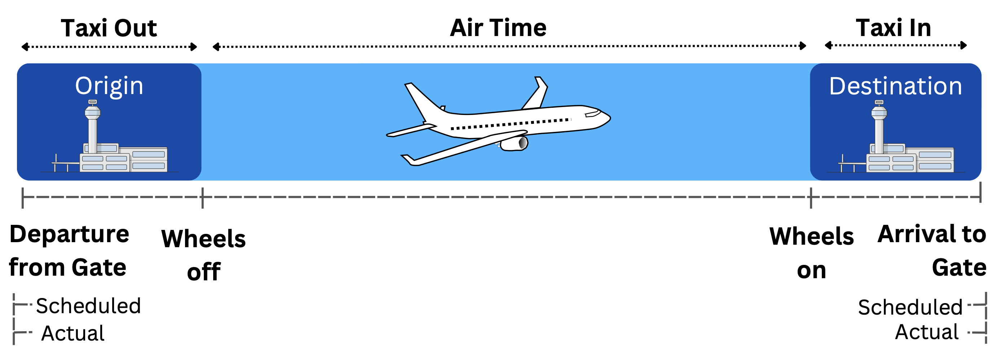
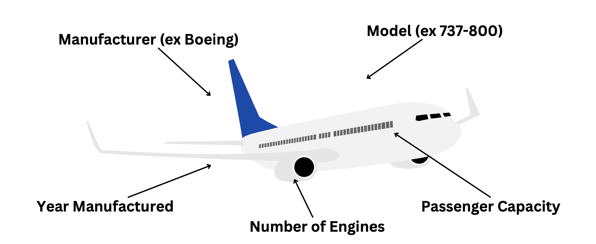
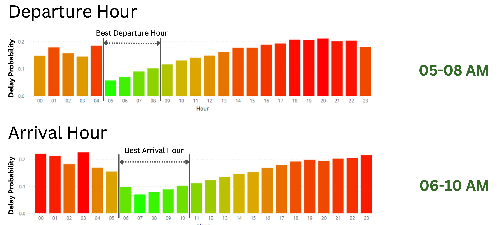
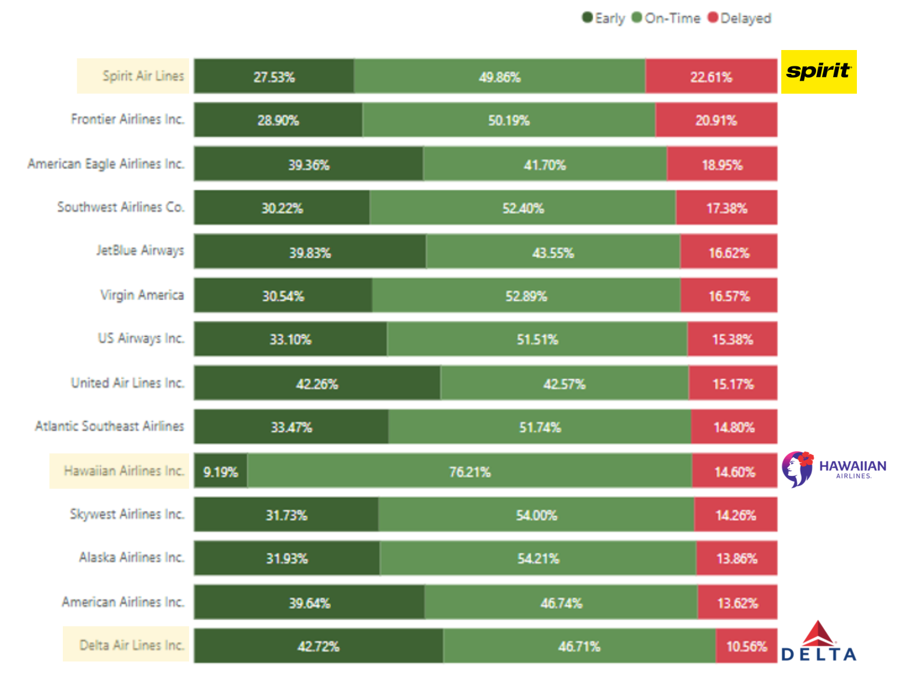
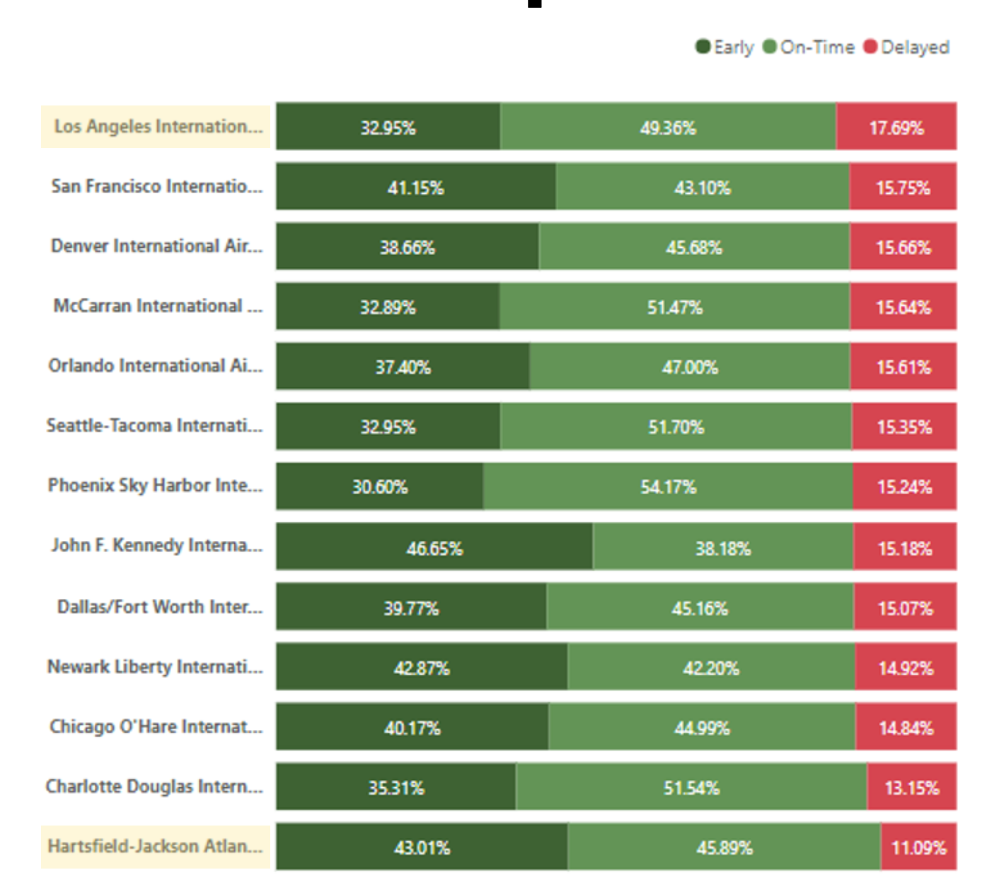
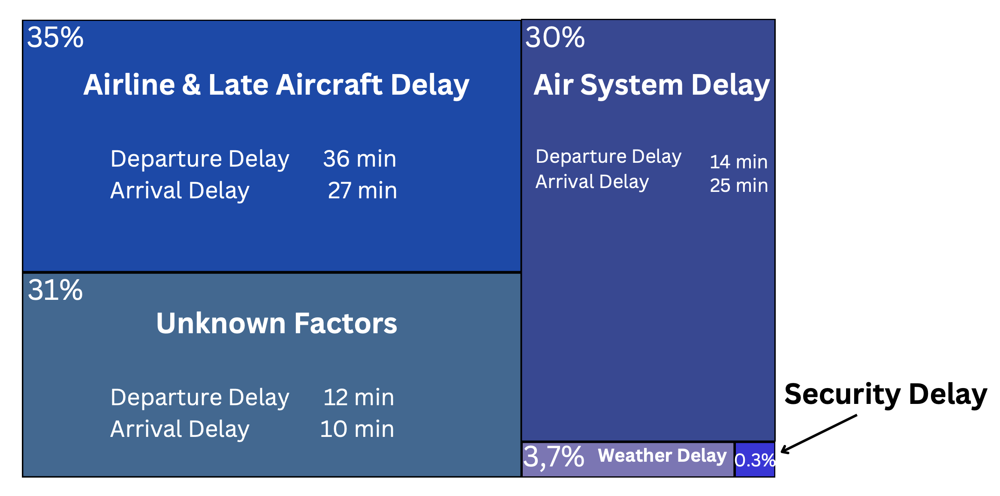
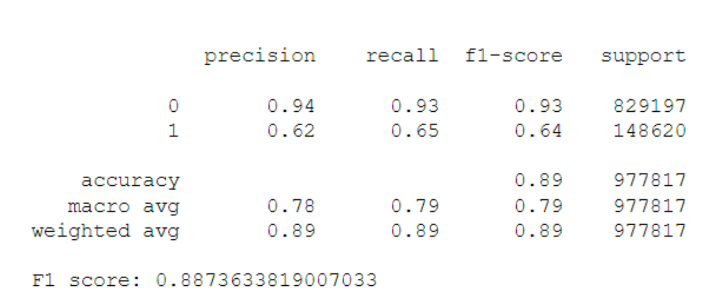

# 2015 Flight Delays and Cancellations
#### Which airline should you fly on to avoid significant delays?

 

According to The **United States Federal Aviation Administration (FAA)**, a flight is considered to be delayed when it arrives 10 minutes later than its scheduled time. We consider a flight to be early when it arrives at least 10 minutes earlier that the scheduled time.

  

The purpose of this specific work is to perform a comprehensive data analysis task on flight data in order to identify the factors which cause a flight to be delayed. A datawarehouse and an OLAP Cube is built as well as a complete ETL procedure. Visualizations and data mining operations are ultimately performed.

 
The task was part of an assignment during the course Business Intelligence and Big Data Analytics of the Department of Management Science and Technology in the Athens University of Economics in Greece.

## Dataset 

The main dataset comes from the The U.S. Department of Transportation's (DOT) Bureau of Transportation Statistics and was extracted from Kaggle: [2015 Flight Delays and Cancellations](https://www.kaggle.com/datasets/usdot/flight-delays?select=airlines.csv). The DOT tracks the on-time performance of domestic flights operated by large air carriers. Summary information on the number of on-time, delayed, canceled, and diverted flights is published in DOT's monthly Air Travel Consumer Report and in this dataset of 2015 flight delays and cancellations.
 
 

  

An additional dataset was used in order to obtain information on the aircraft. The database ["Aircraft Registration" from the Federal Aviation Administration](https://www.faa.gov/licenses_certificates/aircraft_certification/aircraft_registry/releasable_aircraft_download) was used.  

The information gathered is depicted in the graphic below

  

 

The core objetive of the task is to identify the factors which cause a flight to be delayed. 

## Data Warehouse Architecture & ETL process

An OLAP Cube was implemented and the Star Schema architecture was implemented. In total: 1 Fact table & 7 Dimensions

- Fact table
    - Flight Data & Measures
- Dimensions
    - Date
    - Departure & Arrival Time
    - Origin & Destination Airport
    - Airline
    - Aircraft

Python libraries were used to perform the ETL process. The datawarehouse as well as the OLAP cube were built using Microsofts Visual Studio. The full code can be found [here](/Code/).

## Insights from Visuals

1. Departure Time between **05 and 08 in the morning** has the **lowest probability of flight delay**. Same applies for the Arrival Time (06-10AM). One would expect that overnight hours are the optimal timeframe but delays then (00-04 AM) are often as due to less traffic controllers on duty, crew and bad weather.

  

2. Delta Airlines ranks 1st in Early and On-Time performance

- **Spirit Air** is **late** with a 22% probability
- **Hawaiian Airlines** flights are mostly **on time** (76%)
- **Delta Airlines** flights arrive **early or on time** with a 89% probability

  

3. The destination airport is also a crucial factor when it comes causing delays

- Flights landing at the **Los Angeles International Airport (LAX)** arrive **delayed with 18% probability**.
- Flights landing in **Hartsfield Jackson Atlanta International Airport** arrive mostly **early or on time** (89%) 

  

## Predicting the Flight Delay probability

In total, 3 Data Mining tasks were executed.

| Model | Task | Business Application |
|----------|----------| ----------|
| Clustering (KMeans) | Grouping flights based on reasons of delay | Identifying the main causes |
| Regression (XGBRegressor) | Predicting a flights delay in minutes | Accurate planning by Airlines and Passengers | 
| Binary Classification (XGBClassifier) | Predicting whether a flight will arrive delayed or not | Accurate planning by Airlines and Passengers | 

1. **Grouping flights based on reasons of delay**

The core causes of a flight delay are visualised in the graph below

  

2. **Predicting a flights delay in minutes**

The model turned out to be precise enough:

| Metric | Result | 
|----------|----------| 
| Mean Absolute Error | 4.5min | 
| R | 85% | 

3. **Predicting whether a flight will arrive delayed or not**

  

*A detailed overview of the attributes used foreach of the models can be found [here](/Code/)*

## Flying tips 

1. The least delayed airline is Delta.
2. The best airport to avoid delays is the Hartsfield Jackson Atlanta International Airport.
3. The best month to fly is September
4. The best time to depart and arrive is early morning (04-09 AM).

## Authors 

- [Priovolos Philippos](https://github.com/Philippos01) 
- [Bouris Dimitris](https://github.com/dbouris)